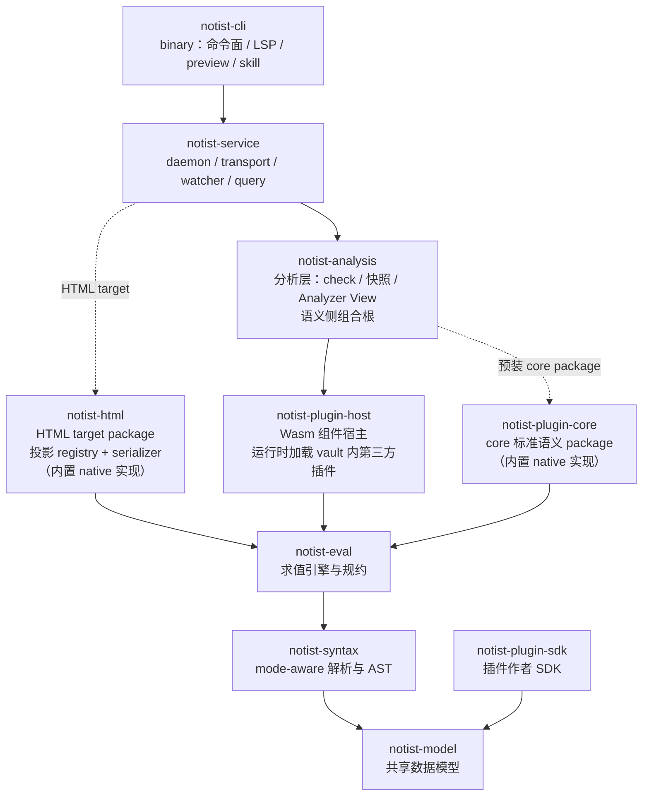

= Notist Crate Architecture

依赖方向：A → B 表示 A 依赖 B。

- **实线**：结构性依赖（引擎与基础设施）；
- **虚线**：概念上的插件装载——被指向的 package 当前以内置 native crate
  静态注册实现，但与普通插件共享同一 contribution 模型，backend 可替换
  （见 designs/plugin-system/runtime-composition.not）：
  - `notist-plugin-core`：语义侧标准 package，由 analysis（组合根）预装；
  - `notist-html`：投影侧 target package，由 service 消费。
- 第三方 Wasm 插件不在图中成节点：由 analysis 经 `notist-plugin-host`
  在运行时动态装载。

